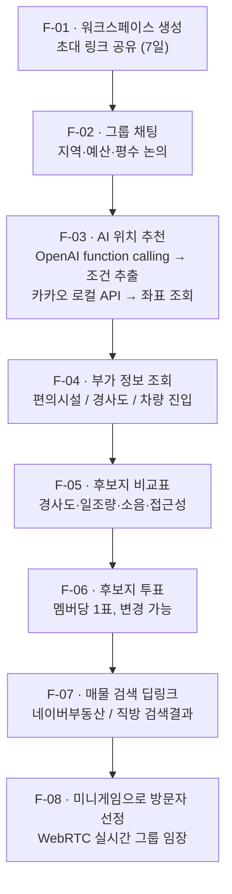

# ZIPFIT — Backend (`zipfit`)

> **같이 집 찾기.** 친구들과 워크스페이스를 만들어 함께 집을 알아보는 과정(대화 → AI 위치 추천 → 후보지 비교 → 투표 → 매물 검색 → 임장)을 하나의 공간에서 처리하는 서비스의 백엔드 저장소.

2026 계명대학교 컴퓨터공학전공 **캡스톤 디자인(1)** 프로젝트 · 팀 **목데이터**


---

## 목차

1. [Overview](#overview)
2. [Core Features](#core-features)
3. [서비스 흐름](#서비스-흐름)
4. [Tech Stack](#tech-stack)
5. [Getting Started](#getting-started)
6. [환경 변수](#환경-변수)
7. [Folder Structure](#folder-structure)
8. [API 개요 (Draft)](#api-개요-draft)
9. [데이터베이스](#데이터베이스)
10. [외부 API 사용 정책 및 법적 고려사항](#외부-api-사용-정책-및-법적-고려사항)
11. [Collaboration Rules](#collaboration-rules)
12. [Team — 목데이터](#team--목데이터)
13. [Schedule](#schedule)
14. [관련 문서](#관련-문서)

---

## Overview

집을 혼자 구할 때는 조건만 맞으면 되지만, **여럿이 함께 구할 때는 합의 과정 자체가 일**이 된다.

기존 부동산 플랫폼(직방·다방·네이버부동산)은 **개인 탐색**에 최적화되어 있어, 그룹이 집을 구할 때 필요한 과정은 전부 플랫폼 밖에서 벌어진다.

| 단계 | 현재 방식 | 문제 |
|---|---|---|
| 조건 논의 | 카카오톡 단톡방 | 대화가 흘러가고 조건이 정리되지 않음 |
| 지역 후보 좁히기 | 각자 검색 후 링크 공유 | 기준 없이 감으로 비교 |
| 후보지 비교 | 노션/엑셀 수기 작성 | 경사도·소음 등 실제 거주 요인은 조사 자체가 어려움 |
| 의사결정 | 단톡방에서 "난 여기" | 누가 어디에 찬성했는지 추적 불가 |
| 임장 | 시간 되는 사람이 혼자 방문 | 못 간 사람은 사진·말로만 전달받음 |

**ZIPFIT은 이 다섯 단계를 하나의 워크스페이스 안으로 가져온다.**
대화를 AI가 분석해 조건을 추출하고, 지도 위에 후보 위치를 제안하고, 객관적 지표로 비교표를 만들고, 투표로 합의하고, 임장은 화상으로 같이 본다.

**1차 개발 범위(MVP)는 F-01 ~ F-08**이다.
지역 커뮤니티(F-09)는 게시판 운영자 책임(정보통신망법상 유통 정보 관리 의무)이 추가로 발생하므로 **Phase 2로 분리**한다.

---

## Core Features

### MVP (F-01 ~ F-08)

| # | 기능 | 설명 | 핵심 기술 |
|---|------|------|-----------|
| **F-01** | 워크스페이스 생성 / 초대 | 호스트가 워크스페이스를 만들고 초대 링크(기본 **7일 만료**)로 친구를 참여시킴 | JPA, 토큰 기반 초대 링크 |
| **F-02** | 그룹 채팅 | 실시간 텍스트 채팅으로 지역·예산·평수 등 조건 논의<br>※ **대화 내용 AI 분석 사용 동의 고지 필요** | WebSocket (STOMP) |
| **F-03** | AI 기반 위치 추천 | 대화 로그를 OpenAI API(**function calling**)로 분석해 조건 추출 → 카카오 로컬 API로 좌표 조회 → 지도에 마커 표시 | OpenAI API, 카카오 로컬 API |
| **F-04** | 부가 정보 추천 | 추천 위치에 대해 편의시설·경사도·자동차 진입 가능 여부 등 추가 조회 제안 | 카카오 로컬/모빌리티 API, 고도(DEM) 데이터 |
| **F-05** | 후보지 비교표 | 경사도 · 일조량 · 소음위험 · 편의시설 접근성 등을 항목별로 비교 (F-03/F-04 데이터 재사용) | 집계 쿼리 |
| **F-06** | 후보지 투표 | 후보지별 👍/👎, **멤버당 1표(변경 가능)**, 의견이 갈리는 후보지 하이라이트 | Unique 제약 (workspace, member, candidate) |
| **F-07** | 매물 검색 링크 연결 | 후보지 지역/조건을 조합해 네이버부동산·직방 등 **검색결과 페이지 딥링크** 생성<br>⚠️ **상세매물 크롤링 금지** | URL 조합 (크롤링 없음) |
| **F-08** | 방문자 선정 미니게임 + 실시간 그룹 투어 | 임장 방문자를 미니게임으로 선정, WebRTC 화상통화로 같은 워크스페이스 멤버가 실시간 참여 (**비공개, ≤6인 가정**) | WebRTC, Signaling (WebSocket) |

### Phase 2 (보류)

| # | 기능 | 보류 사유 |
|---|------|-----------|
| F-09 | 지역 커뮤니티 | 게시판 운영 시 **정보통신망법상 운영자 책임**(불법정보 유통 관리, 신고·삭제 절차 등)이 추가 발생 → MVP 범위에서 분리 |

> 기능 상세는 **팀 기능명세서** 문서 참고.

---

## 서비스 흐름



---

## Tech Stack

### 확정 (`build.gradle` 기준)

| 계층 | 기술 |
|---|---|
| **Language / Build** | Kotlin 2.3.21, Gradle (Groovy DSL), **Java 25 toolchain** |
| **Framework** | Spring Boot 4.1.1 |
| **Web / 실시간** | Spring Web MVC, Spring WebSocket |
| **DB** | Spring Data JPA + PostgreSQL |

### 예정 (미적용)

| 계층 | 기술 | 용도 |
|---|---|---|
| **인증** | Spring Security + JWT, BCrypt | 회원가입/로그인, 워크스페이스 접근 제어 |
| **마이그레이션** | Flyway | DDL 버전 관리 |
| **공간 데이터** | PostGIS | 위치 좌표 저장·반경 검색 |
| **외부 연동** | OpenAI API (Chat Completions, function calling)<br>카카오맵 로컬 / 모빌리티 API | F-03, F-04 — **키는 서버에서만 보관** |
| **인프라** | AWS EC2(Docker) + RDS(PostgreSQL) + S3 | 배포 |
| **CI/CD** | GitHub Actions | 빌드/테스트 → EC2 배포 |

> **TBD** — 명세서에는 있지만 아직 `build.gradle`에 없는 의존성: `Spring Security(JWT)`, `Flyway`, `PostGIS`, `BCrypt`.
> 인증 / DB 마이그레이션 작업 시작 시 추가 필요.

---

## Getting Started

### 사전 요구사항

| 항목 | 버전 | 비고 |
|---|---|---|
| JDK | **25** | `build.gradle`의 toolchain 요구사항 |
| PostgreSQL | 14 이상 권장 | 로컬 또는 Docker |
| Git | - | - |

> ⚠️ **JDK 25 관련 주의**
> `build.gradle`이 **Java 25 toolchain**을 요구한다. 로컬에 JDK 25가 없으면
> `./gradlew build` 실행 시 **toolchain 다운로드 저장소 미설정**으로 실패한다.
>
> 해결 방법 **둘 중 하나**:
> 1. JDK 25 직접 설치 (권장 — 예: Temurin 25)
> 2. `settings.gradle`에 Foojay toolchain resolver 플러그인 추가
>    ```groovy
>    plugins {
>        id 'org.gradle.toolchains.foojay-resolver-convention' version '0.8.0'
>    }
>    ```

### 로컬 실행

```bash
# 1. 클론
git clone https://github.com/MockData-Capstone/Backend.git
cd Backend

# 2. PostgreSQL 실행 (Docker 예시)
docker run -d --name zipfit-db \
  -e POSTGRES_DB=zipfit \
  -e POSTGRES_USER=zipfit \
  -e POSTGRES_PASSWORD=zipfit \
  -p 5432:5432 postgres:16

# 3. 환경 변수 설정 (아래 '환경 변수' 섹션 참고)
cp src/main/resources/application-local.yml.example \
   src/main/resources/application-local.yml

# 4. 실행
./gradlew bootRun
```

기본 포트: `http://localhost:8080`

### 빌드 / 테스트

```bash
./gradlew build          # 컴파일 + 테스트 + 패키징
./gradlew test           # 테스트만
./gradlew bootJar        # 실행 가능한 JAR 생성
java -jar build/libs/*.jar
```

---

## 환경 변수

> 🔐 **API 키는 절대 저장소에 커밋하지 않는다.**
> `application-local.yml`, `.env` 는 반드시 `.gitignore`에 포함할 것.
> 운영 환경에서는 환경 변수 또는 AWS Parameter Store / Secrets Manager 사용.

| 변수 | 설명 | 예시 | 필수 |
|---|---|---|---|
| `DB_URL` | PostgreSQL 접속 URL | `jdbc:postgresql://localhost:5432/zipfit` | ✅ |
| `DB_USERNAME` | DB 사용자 | `zipfit` | ✅ |
| `DB_PASSWORD` | DB 비밀번호 | - | ✅ |
| `JWT_SECRET` | JWT 서명 키 (256bit 이상) | - | ✅ (인증 구현 후) |
| `JWT_ACCESS_EXPIRE` | Access Token 만료(ms) | `1800000` (30분) | ⬜ |
| `JWT_REFRESH_EXPIRE` | Refresh Token 만료(ms) | `1209600000` (14일) | ⬜ |
| `OPENAI_API_KEY` | OpenAI API 키 | `sk-...` | ✅ (F-03) |
| `OPENAI_MODEL` | 사용할 모델명 | - | ⬜ |
| `KAKAO_REST_API_KEY` | 카카오 REST API 키 | - | ✅ (F-03, F-04) |
| `INVITE_LINK_TTL_DAYS` | 초대 링크 만료일 | `7` | ⬜ |
| `TOUR_MAX_PARTICIPANTS` | 그룹 투어 최대 인원 | `6` | ⬜ |

---

## Folder Structure

도메인별 패키지 구조를 사용한다. 루트 패키지는 `com.mockdata.zipfit`이다.

```
src/main/kotlin/com/mockdata/zipfit/
├── ZipfitApplication.kt      # 엔트리포인트
│
├── auth/                     # 회원가입, 로그인, JWT 발급/재발급, (이후) Google OAuth
├── workspace/                # 워크스페이스 생성/초대/멤버 관리            [F-01]
├── chat/                     # 채팅 메시지 저장/조회, WebSocket(STOMP) 핸들러 [F-02]
├── recommendation/           # 대화 로그 → OpenAI 호출 → 카카오 API 조회
│                             #  → 추천 위치 저장                        [F-03, F-04]
├── candidate/                # 후보지, 비교 지표(경사도/일조량/소음 등)    [F-05]
├── vote/                     # 후보지 투표                              [F-06]
├── listing/                  # 매물 검색 딥링크 조합 생성                 [F-07]
├── tour/                     # 방문자 선정 미니게임, WebRTC 시그널링,
│                             #  세션 관리                               [F-08]
└── common/
    ├── config/               # SecurityConfig, FlywayConfig, WebSocketConfig (예정)
    ├── exception/            # GlobalExceptionHandler
    └── security/             # JwtAuthenticationFilter, CurrentUser
```

### 도메인 패키지 내부 규칙

```
<domain>/
├── controller/    # REST 엔드포인트 (요청/응답 DTO 변환만)
├── service/       # 비즈니스 로직
├── repository/    # JPA Repository
├── entity/        # JPA 엔티티
└── dto/           # Request / Response DTO
```

- **Controller는 로직을 갖지 않는다.** 검증 후 Service 호출까지만.
- **엔티티를 API 응답으로 직접 반환하지 않는다.** 반드시 DTO 변환.
- 도메인 간 호출은 **Service 레이어를 통해서만** 한다 (Repository 직접 참조 금지).

---

## API 개요 (Draft)

> 아래는 설계 초안이며, 구현 진행에 따라 변경된다. 확정 스펙은 Swagger(springdoc-openapi) 도입 후 `/swagger-ui.html` 참고 예정.

| Method | Endpoint | 설명 | 기능 |
|---|---|---|---|
| `POST` | `/api/auth/signup` | 회원가입 | - |
| `POST` | `/api/auth/login` | 로그인 (JWT 발급) | - |
| `POST` | `/api/auth/reissue` | Access Token 재발급 | - |
| `POST` | `/api/workspaces` | 워크스페이스 생성 | F-01 |
| `GET` | `/api/workspaces/{id}` | 워크스페이스 상세 | F-01 |
| `POST` | `/api/workspaces/{id}/invites` | 초대 링크 생성 (7일 만료) | F-01 |
| `POST` | `/api/invites/{token}/accept` | 초대 수락 (멤버 등록) | F-01 |
| `GET` | `/api/workspaces/{id}/messages` | 채팅 메시지 조회 (페이징) | F-02 |
| `WS` | `/ws/chat` | 실시간 채팅 (STOMP) | F-02 |
| `POST` | `/api/workspaces/{id}/recommendations` | 대화 로그 분석 → 위치 추천 | F-03 |
| `GET` | `/api/recommendations/{id}/nearby` | 추천 위치 주변 부가 정보 | F-04 |
| `GET` | `/api/workspaces/{id}/candidates` | 후보지 목록 | F-05 |
| `GET` | `/api/workspaces/{id}/candidates/compare` | 후보지 비교표 | F-05 |
| `POST` | `/api/candidates/{id}/votes` | 투표 (등록/변경) | F-06 |
| `GET` | `/api/workspaces/{id}/votes/summary` | 투표 집계 + 갈등 후보지 | F-06 |
| `GET` | `/api/candidates/{id}/listing-links` | 매물 검색 딥링크 생성 | F-07 |
| `POST` | `/api/workspaces/{id}/tours` | 투어 세션 생성 + 방문자 선정 | F-08 |
| `WS` | `/ws/signal` | WebRTC 시그널링 | F-08 |

---

## 데이터베이스

- **RDBMS**: PostgreSQL
- **ORM**: Spring Data JPA (Hibernate)
- **마이그레이션**: Flyway 도입 예정 — `src/main/resources/db/migration/V{n}__{description}.sql`
- **공간 데이터**: 위치 좌표는 PostGIS 도입 후 `geography(Point, 4326)` 사용 예정 (도입 전에는 `latitude` / `longitude` 컬럼 분리 저장)

### 개발 중 설정

```yaml
spring:
  jpa:
    hibernate:
      ddl-auto: update   # 로컬 개발 한정. Flyway 도입 후 validate 로 전환
    properties:
      hibernate:
        format_sql: true
```

> ⚠️ 운영 환경에서 `ddl-auto: update` 사용 금지. Flyway 도입 후 반드시 `validate`로 변경할 것.

### 주요 제약

| 테이블 | 제약 | 이유 |
|---|---|---|
| `workspace_member` | `UNIQUE (workspace_id, user_id)` | 중복 참여 방지 |
| `vote` | `UNIQUE (candidate_id, user_id)` | 멤버당 1표 (변경은 UPDATE) |
| `invite` | `expires_at` 인덱스 | 만료 링크 정리 |

---

## 외부 API 사용 정책 및 법적 고려사항

캡스톤 프로젝트지만 **실제 서비스와 동일한 기준**으로 다음을 준수한다.

### 1. 매물 데이터 — 크롤링 금지 (F-07)

- 네이버부동산·직방 등의 **상세 매물 데이터를 수집·저장하지 않는다.**
- 대신 후보지 조건을 조합해 각 플랫폼의 **검색결과 페이지 딥링크만 생성**한다.
- 사유: 각 플랫폼 이용약관상 자동 수집 금지 + 데이터베이스권(저작권법 제93조) 침해 소지.

### 2. 대화 내용 AI 분석 동의 (F-02, F-03)

- 채팅 내용을 OpenAI API로 전송해 분석하므로, **가입 또는 워크스페이스 최초 진입 시 별도 고지·동의**가 필요하다.
- 고지 항목: 처리 목적(조건 추출), 제3자 제공(OpenAI), 보관 기간.

### 3. API 키 보관

- OpenAI·카카오 API 키는 **서버에서만 보관**하며 클라이언트로 내려보내지 않는다.
- 프론트엔드가 필요한 지도 표시용 키는 **카카오 JavaScript 키(도메인 제한 설정)** 를 별도로 사용한다.

### 4. WebRTC 투어 (F-08)

- 투어 세션은 **비공개**이며, 해당 워크스페이스 멤버만 입장 가능하다.
- 영상은 **저장하지 않고 실시간 전달만** 한다(녹화 기능 미제공).

### 5. 커뮤니티 기능 보류 (F-09)

- 게시판 운영 시 정보통신망법상 **운영자의 유통 정보 관리 의무**가 발생하므로 MVP에서 제외하고 Phase 2로 분리.

---

## Collaboration Rules

### 브랜치 전략

```
main        # 배포 가능한 안정 버전
└── develop # 통합 개발 브랜치
    ├── feature/F-01-workspace
    ├── feature/F-03-ai-recommendation
    └── fix/chat-websocket-reconnect
```

- 모든 작업은 `develop`에서 분기한 **기능 단위 브랜치**에서 진행
- 브랜치명: `feature/F-{번호}-{요약}` / `fix/{요약}` / `docs/{요약}`
- **`main`, `develop` 직접 push 금지** → 반드시 PR

### 커밋 컨벤션

```
<type>: <subject>

<body (선택)>
```

| type | 용도 |
|---|---|
| `feat` | 새 기능 추가 |
| `fix` | 버그 수정 |
| `docs` | 문서 수정 (README 등) |
| `style` | 코드 포맷팅 (동작 변경 없음) |
| `refactor` | 리팩터링 (기능 변경 없음) |
| `test` | 테스트 코드 추가/수정 |
| `chore` | 빌드 설정, 의존성 등 |

예시:
```
feat: 워크스페이스 초대 링크 생성 API 구현
fix: STOMP 재연결 시 중복 구독 발생 문제 수정
docs: README에 환경 변수 섹션 추가
```

### PR 규칙

- PR 제목은 커밋 컨벤션과 동일한 형식
- 본문에 **관련 이슈 번호**(`Closes #12`)와 변경 요약 작성
- **리뷰어 1명 이상 승인 후 merge**
- merge 방식: `Squash and merge` 권장

### 이슈 관리

- 기능 단위로 이슈 생성 (`[F-03] AI 위치 추천 API`)
- GitHub Projects 보드로 `Todo → In Progress → Review → Done` 관리

> 📊 개인 코드 기여도는 [`git-quick-stats`](https://git-quick-stats.sh) 로 정량 집계된다.
> **본인 계정으로 커밋**하고, 로컬 `user.email`이 GitHub 계정 이메일과 일치하는지 확인할 것.
> ```bash
> git config user.name  "본인이름"
> git config user.email "github계정이메일"
> ```

---

## Team — 목데이터

| 이름 | 역할 | 담당 업무 | 관련 기능 |
|------|------|-----------|-----------|
| **신한목** | PM | 일정·이슈 관리, 요구사항 정의, 아키텍처 문서화, 산출물 총괄 | 전체 |
| **황성민** | Full-stack | 실시간 계층 — WebSocket(STOMP) 채팅 서버, WebRTC 시그널링 및 투어 세션, 프론트–백 연동 | F-02, F-08 |
| **이상민** | Backend / Infra | AI 추천 엔진 — OpenAI function calling 연동, 조건 추출 파이프라인, 클라우드 배포 및 CI/CD | F-03, F-04 |
| **구대현** | Backend | 인증(JWT), 워크스페이스·초대, 투표, 매물 딥링크 생성, DB 스키마 설계 및 마이그레이션 | F-01, F-06, F-07 |
| **손지은** | Frontend / Design | UI/UX 디자인 총괄, 디자인 시스템, 지도·후보지 비교 화면 | F-04, F-05 |
| **김석현** | Frontend | 그룹 채팅 · AI 추천 결과 화면, 프론트–백엔드 API 연동 전담 | F-02, F-03 |
| **표다은** | Frontend / Design | 화면 디자인·퍼블리싱, 워크스페이스·투표·미니게임 화면 | F-01, F-06, F-08 |

---

## Schedule

| 기간 | 작업 |
|---|---|
| 9월 | 주제 확정, 요구사항 정의, 기능명세서 작성 |
| 9월 말 ~ 10월 | DB·API 설계, 인프라 구축, 인증/워크스페이스 구현 |
| 10월 ~ 11월 | AI 추천(F-03/F-04), 채팅(F-02), 후보지 비교·투표(F-05/F-06) |
| 10월 말 ~ 11월 | WebRTC 그룹 투어(F-08), 매물 딥링크(F-07) |
| 11월 말 ~ 12월 | 통합 테스트, CI/CD 무중단 배포, 데모 영상 제작 |

### 마일스톤

- **10/06** — 팀 발표 #3 (중간 공유)
- **10/27, 11/17** — 진행 상황 공유
- **12/08** — 최종 발표 및 데모 시연

---

## 관련 문서

| 문서 | 내용 |
|---|---|
| 기능명세서 | F-01 ~ F-09 상세 요구사항 |
| 백엔드 아키텍처 명세서 | 인증 흐름, DB 설계, 배포 구조, 보안 |
| 팀 발표 자료 | 프로젝트 개요, 일정, R&R |

---

<sub>© 2026 팀 목데이터 · 계명대학교 컴퓨터공학전공 캡스톤 디자인(1)</sub>
